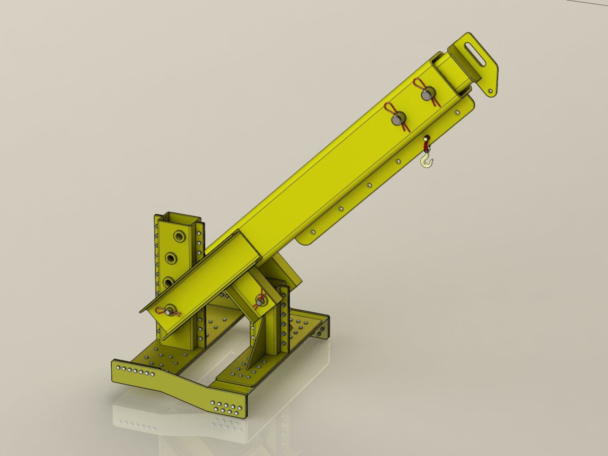
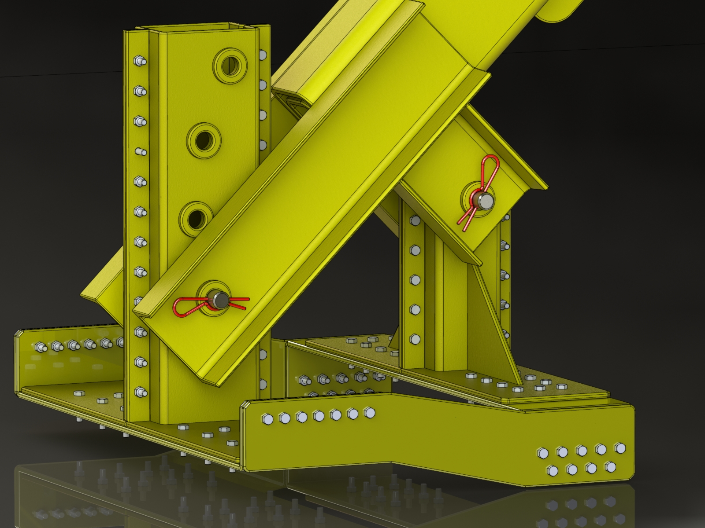
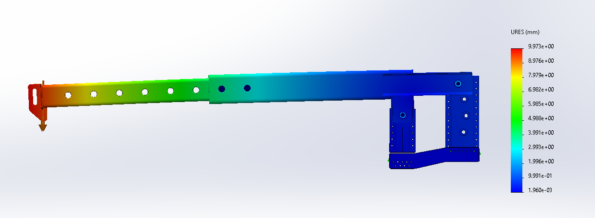

# Telescopic Jib Crane Design for Forklift

<p align="center">

</p>

## Overview

This project focuses on the mechanical design and structural development of a telescopic jib crane attachment for a 3-ton forklift.

The objective was to develop a compact, manufacturable lifting attachment capable of handling a 1.5-ton load while maintaining structural safety, adjustable reach, and practical manufacturing requirements.

---

## Design Requirements

- Forklift-mounted lifting attachment
- Maximum lifting capacity: 1.5 tons
- Adjustable telescopic boom
- Adjustable tilt angle
- Bolt-on mounting structure
- Manufacturing-oriented design

---

## Design Process

The design was developed through the following engineering workflow:

1. Requirement definition and load estimation
2. Mechanical concept development
3. 3D CAD modeling and assembly design
4. Structural verification using FEA
5. Manufacturing and assembly considerations

---

## Key Specifications

| Parameter | Value |
|---|---|
| Forklift Capacity | 3 tons |
| Designed Load Capacity | 1.5 tons |
| Maximum Reach | 2.5 m |
| Safety Factor | ≈6 |
| Extension Step | 100 mm |
| Tilt Adjustment | 0°–45° |
| Material | ST52 Structural Steel (Assumed) |

---

## CAD Development

The complete assembly was designed using **SolidWorks 2024**.

The model includes:

- Telescopic boom mechanism
- Fork mounting structure
- Pivot mechanism
- Reinforcement plates
- Bolted connections

<p align="center">

</p>

---

# Structural Simulation

Static structural analysis was performed using **SolidWorks Simulation** to evaluate the mechanical performance of the structure under loading conditions.

## Simulation Setup

The analysis was performed based on the following assumptions:

- Fixed support applied at the forklift fork mounting region
- Vertical lifting load applied at the boom tip
- Linear elastic material behavior
- ST52 structural steel material properties

---

## Stress Analysis

Von Mises stress distribution was evaluated to verify structural strength.

<p align="center">

</p>

Maximum von Mises stress:

```
58.75 MPa
```

Based on the assumed yield strength of ST52 structural steel:

```
Safety Factor ≈ 6
```

The obtained stress level indicates acceptable structural performance under the considered loading condition.

---

## Displacement Analysis

Maximum deformation was evaluated to assess the structural rigidity.

<p align="center">

</p>

Maximum displacement:

```
9.97 mm
```

The deformation results were used to evaluate stiffness and serviceability of the structure under the applied loading condition.

---

# Manufacturing Considerations

The design was developed considering practical manufacturing constraints:

- Welded steel structure
- Standard fasteners
- Machinable components
- Assembly and maintenance accessibility
- Manufacturing-oriented geometry

---

# Project Files

Available project files include:

- SolidWorks assembly and part files
- Engineering drawings
- Structural simulation results
- Rendered visualization images

---

# Software & Tools

- SolidWorks 2024
- SolidWorks Simulation
- Mechanical Design
- CAD Modeling
- Structural Analysis
- Finite Element Analysis (FEA)

---

# Project Skills Demonstrated

- Mechanical System Design
- 3D CAD Assembly
- Structural Design
- Finite Element Analysis
- Manufacturing-Oriented Engineering
- Engineering Documentation
